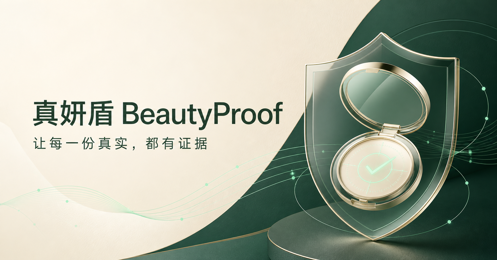
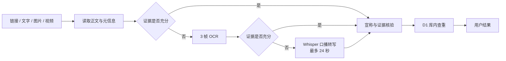

# 真妍盾 BeautyProof

> 面向消费者的美妆内容可信度检测 H5 —— 把“这条推荐能不能信”变成有原文、有依据、有边界的结果。

[](https://nodejs.org/)
[](https://react.dev/)
[](https://www.typescriptlang.org/)

真妍盾是欧莱雅黑客松赛道二 Demo。用户可以粘贴小红书或抖音公开作品链接，也可以直接提交文字、图片或视频。系统从正文、画面和口播中提取宣传内容，识别医疗化、绝对化、量化功效、毛发生长、人物背书等风险信号，并把命中的原文与监管资料或研究证据对应起来。

线上体验：[beautyproof-h5.yaowen-hu.chatgpt.site](https://beautyproof-h5.yaowen-hu.chatgpt.site/)（当前为受限演示环境，可能需要登录授权）



## 产品解决什么问题

消费者看到美妆推荐时，真正需要的不是一份复杂的技术报告，而是三个答案：

1. 这条内容主要说了什么？
2. 哪些表述值得警惕，原文在哪里？
3. 结论依据是什么，证据能说明到什么程度？

因此，产品默认直接展示“建议采信 / 谨慎采信 / 不建议采信”、关键问题和对应原文；指纹、OCR、ASR、内容凭证等技术信息只用于支撑判断，不喧宾夺主。

## 已实现能力

### 多种输入

- 小红书、抖音 HTTPS 公开作品链接；
- 直接粘贴宣传文字；
- 上传图片或视频进行本地内容抽取。

### 内容抽取

- 解析平台跳转、作品 ID、标题、正文、作者和公开媒体；
- 图片使用 Tesseract.js 进行中英文 OCR；
- 视频抽取 3 个代表性画面进行 OCR；
- 证据仍不足时，使用 Whisper 分析最多前 24 秒口播；
- 对重复、退化或无意义的转写结果进行质量拒绝。

### 宣称与证据核验

- 识别疾病治疗、医疗作用、绝对化效果、量化周期、永久效果、人物背书和“天然”等表述；
- 针对睫毛增长、乌斯玛草、前列腺素类似物等案例给出专门核验提示；
- 关联 NMPA、SAMR、FDA、论文和人体研究等公开资料；
- 每条问题保留本次作品原文，展示证据强度、适用范围和结论边界。

### 内容指纹与库内查重

- 文件 SHA-256：判断字节级完全一致；
- 图片感知指纹：发现近似图片；
- 视频关键帧指纹：发现近似视频画面；
- 文字 SimHash：发现近似文案；
- C2PA、EXIF：在文件包含相关信息时读取内容凭证和设备/编辑元数据；
- D1 分析记录库：与本系统最近检测的内容进行比对。

### 极速检测路径

系统遵循“证据足够即停止”的原则。正文已经包含明确宣称时，直接进入分析，不下载媒体，也不运行 OCR 或 Whisper；只有正文不足时才按需逐级回退。



当前还包含两级短期缓存：浏览器端复用同一链接的解析结果，服务端对成功解析缓存 5 分钟，减少平台访问和重复等待。

## 能力边界

请在演示、答辩和二次开发时保留以下边界：

- 本项目判断的是**内容宣称的可信风险**，不是商品真伪、违法性或安全性的司法/监管认定；
- 查重只覆盖本系统已经检测并写入数据库的内容，不代表全网查重；
- “未命中风险”不等于宣传一定真实，“没有 C2PA/EXIF”也不等于内容经过伪造；
- 平台可能因登录、风控或页面变化而只返回作品标识，此时应上传原图或原视频继续分析；
- OCR、ASR 和规则匹配均可能出现遗漏，重要消费或健康决策应结合商品备案、完整成分表、功效评价摘要和专业意见；
- 当前没有接入深度伪造检测或通用 AI 生成内容分类模型。

## 技术架构

| 层级 | 主要实现 | 职责 |
| --- | --- | --- |
| 前端 | React 19、TypeScript、Vinext | 输入、抽取进度、结果展示 |
| 链接解析 | `/api/resolve` | 平台白名单、跳转解析、正文与媒体发现、短期缓存 |
| 浏览器分析 | Tesseract.js、Transformers.js、C2PA、EXIF | OCR、Whisper、指纹与元数据读取 |
| 规则与证据 | `lib/shared/evidence.ts` | 宣称识别、原文定位、权威资料映射 |
| 报告与查重 | `/api/analyze`、Cloudflare D1 | 风险汇总、相似内容比对、分析记录保存 |
| 媒体代理 | `/api/media` | 对受信任平台媒体进行限时、限量读取 |

原始上传文件主要在浏览器端处理；分析接口接收抽取文字、内容特征和报告所需信息。生产环境仍应进一步完成隐私评审、数据保留策略与用户授权设计。

## 本地运行

### 环境要求

- Node.js 22.13 或更高版本；
- npm；
- 推荐使用最新版 Chromium 浏览器，以获得较好的 WebAssembly 和媒体处理性能。

### 安装与启动

```bash
git clone https://github.com/yaowenhu-pm/beautyproof-h5.git
cd beautyproof-h5
npm install
npm run dev
```

打开 `http://localhost:3000`。

### 常用命令

```bash
npm run dev         # 启动开发环境
npm run test:rules  # 运行典型样本与快速路径回归测试
npm run lint        # 静态检查
npm run build       # 生产构建
npm run start       # 启动生产构建
```

## 项目结构

```text
app/
  api/resolve/      小红书、抖音链接解析
  api/media/        受信任媒体读取代理
  api/analyze/      风险汇总、查重与报告持久化
  page.tsx          H5 主流程与结果界面
lib/
  client/           OCR、ASR、指纹和客户端分析
  server/           D1 数据库初始化
  shared/           宣称证据规则
db/                 Drizzle 数据表定义
drizzle/            D1 迁移文件
scripts/            规则回归测试
public/             品牌与分享资源
方案设计.md          产品与技术设计说明
```

## 当前进度（约 100 字）

- 已完成：三类输入、双平台解析、正文/OCR/ASR 抽取、宣称核验、权威依据、库内查重、结果页与极速路径，并通过六组典型样本回归。
- 待完善：提升平台风控适配和 OCR/ASR 准确率，扩充法规与产品证据库，引入人工复核、全网相似检索、隐私治理、可观测性及规模化评测。

## 路线图

- [ ] 建立覆盖正例、反例、边界案例的版本化评测集；
- [ ] 将规则扩展为可维护的知识库与检索增强流程；
- [ ] 接入产品备案、成分表和功效评价摘要核验；
- [ ] 增加报告反馈、人工复核和误判纠正闭环；
- [ ] 优化低端移动设备上的 OCR/ASR 模型加载与推理；
- [ ] 评估淘宝等电商详情页的公开内容解析，保持与社交推荐场景不同的产品定位；
- [ ] 完善隐私政策、数据删除、限流、监控和异常告警。

## 验证

提交代码前至少运行：

```bash
npm run test:rules
npm run lint
npm run build
```

## 参考文档

- [产品与技术方案](./方案设计.md)
- [国家药品监督管理局](https://www.nmpa.gov.cn/)
- [国家市场监督管理总局](https://www.samr.gov.cn/)
- [FDA Cosmetics](https://www.fda.gov/cosmetics)

## 许可与声明

本仓库当前未声明开源许可证。代码用于比赛 Demo、研究与内部验证；如需复制、分发或商用，请先取得项目所有者许可。本项目不提供医疗诊断、法律意见或监管结论。
